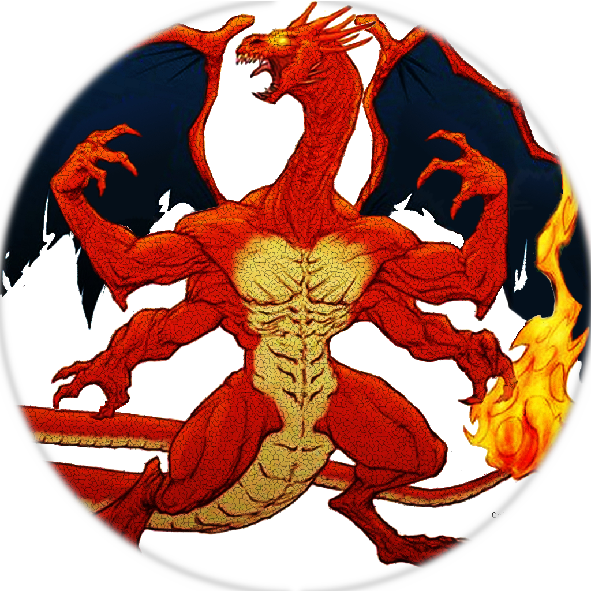

<!-- Profile Header -->

  <!-- Profile Logo -->
    

<h1 align="center">Hi 👋, I'm David Mulgrew</h1>
<h3 align="center">Game Developer | AI Researcher | Programmer</h3>

---

## 📸 About Me

  <!-- Actual Photo -->
  

- 🎓 3rd year Computer Games Programming student at University of Derby  
- 💡 Researching **AI, human–AI interaction, and emerging game technologies**  
- 🛠️ Building projects in **Unity, Unreal Engine, and Godot**  
- 🎮 Focused on **Integrating new AI technologies into game engines, tool production, and VR/AR**  
- ✍️ Publishing research papers in computing and game dev  

---

## 🔗 Links
- 🌐 [Linktree](https://linktr.ee/bigmonmulgrew)  
- 💼 [LinkedIn](https://www.linkedin.com/in/david-mulgrew-508a09219)  
- 🎮 [Unity Play Profile](YOUR_UNITY_PLAY_URL)  
- 📘 [Unity Learn Profile](https://learn.unity.com/u/bigmonmulgrew)  

---

## 🚀 Featured Projects
Here are a few highlights from my GitHub:

- **DerbyGPT** – Early version of the DerbyGPT personality system including integration into social platforms, eg Discord.  
  👉 [View Repo](https://github.com/bigmonmulgrew/DerbyGPT) or find check out the demo Discord with the updated version [here](https://discord.gg/H958mrHcVy)

- **BigMonD_Games** – A collection of simple classic game clones built in Unreal Engine from my first years undergrad games module. Clones based on Pong, Peggle, Breakout and Mario
  👉 [View Repo](https://github.com/bigmonmulgrew/BigMonD_Games)

- **Unity Lesson Plans** – A selection of lesson plans designed to run a single day taster for Unity, written during my first year undergrad.
  👉 [View Repo](https://github.com/bigmonmulgrew/Unity-Lesson-Plan)

---

## 📑 Research Papers
- *Paper Title 1* – [Read Here](https://www.degruyterbrill.com/document/doi/10.1515/edu-2025-0086/html)

*(More coming soon — watch this space 🚀)*

---

## 📊 GitHub Stats

  

---

## 🛠️ Skills
- **Languages**: C#, C++ (Unreal, arduino, OpenGL and DirectX), Python, GDScript, html, css, php, lua, bash, batch, redstone, VBA, VB.net
- **Game Engines**: Unity, Unreal Engine, Godot  
- **Other**: Docker, Web Dev (PHP/JS), AI/LLM Integration, Project Management,  

---

## ✨ Fun Extras
- 🕹️ Long-time gamer and developer — blending **20 years of coding** with **game design passion**  
- 🔬 Exploring the parallels between **AI context blindness** and autistic skill adaptation  
- 🍳 Also into cooking, wood work, and community projects 🎉  

---

  <b>I am an advocate of using AI tools to do new things we could not do without them rather than replacing human creativity</b>
  <i>“Building games, tools, and research that connect people, play, and AI.”</i>

